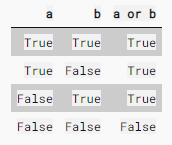

# Data-analysis
## First step with python

Here, I have learnt some basic shortcuts for Jupyter notebook.

    - Select cell on the blue and press A to insert cell above
    - Select cell and press Esc + A to insert cell above
    - Select cell on the blue and press B to insert cell below
    - Select cell and press Esc + B to insert cell below
    - Select cell on the blue and press D twice to delete cell
    - To change the cell type press Esc + Y a then Esc + M for markdown
    - To run cell press Shift + Enter

 

Some basic operators

   

NameError is when we don’t define a variabler beforehand but invoke it.

   

Commenting

- ‘#- - -#’ is for single line comment
- “””- - -””” is for multi line comment

    

Printing

print() is the function for printing something, usually a aiding text, First argument of this function is quoted test like “this a the value” and the second argument is the value of the calculation.

    

Conditional Operator

Result of the compare is either True or Flase

 

Logical Operator

- And Operator

        
- Or Operator

        
- Not Operator  
    - Not operator just inverse the result. i.e. True get False and Flase get True

 
    

Markdown

This is a [link](https://learnxinyminutes.com/docs/markdown/)

     

Further Reading and References

Following are some resources where you can learn about more arithmetic, conditional and logical operations in Python:
    
- [Python Tutorial at W3Schools](https://www.notion.so/Python-586d26da5fc94e37bbaf829054a8fcf2)
- [Practical Python Programming](https://dabeaz-course.github.io/practical-python/Notes/Contents.html)
- [Python official documentation](https://docs.python.org/3/tutorial/index.html)
- [Detailed operator documentation](https://www.geeksforgeeks.org/python-operators/)

 

Questions for Revision

- Try answering the following questions to test your understanding of the topics covered in this notebook:

    1. What is a Jupyter notebook?
    2. How do you add a new code cell below an existing cell?
    3. How do you add a new Markdown cell below an existing cell?
    4. How do you convert a code cell to a Markdown cell or vice versa?
    5. How do you execute a code cell within Jupyter?
    6. What the different arithmetic operations supported in Python?
    7. How do you perform arithmetic operations using Python?
    8. What is the difference between the `/` and the `//` operators?
    9. What is the difference between the `` and the `*` operators?
    10. What is the order of precedence for arithmetic operators in Python?
    11. How do you specify the order in which arithmetic operations are performed in an expression involving multiple operators?
    12. How do you solve a multi-step arithmetic word problem using Python?
    13. What are variables? Why are they useful?
    14. How do you create a variable in Python?
    15. What is the assignment operator in Python?
    16. What are the rules for naming a variable in Python?
    17. How do you view the value of a variable?
    18. How do you store the result of an arithmetic expression in a variable?
    19. What happens if you try to access a variable that has not been defined?
    20. How do you display messages in Python?
    21. What type of inputs can the print function accept?
    22. What are code comments? How are they useful?
    23. What are the different ways of creating comments in Python code?
    24. What are the different comparison operations supported in Python?
    25. What is the result of a comparison operation?
    26. What is the difference between `=` and `==` in Python?
    27. What are the logical operators supported in Python?
    28. What is the difference between the `and` and `or` operators?
    29. Can you use comparison and logical operators in the same expression?
    30. What is the purpose of using parentheses in arithmetic or logical expressions?
    31. What is Markdown? Why is it useful?
    32. How do you create headings of different sizes using Markdown?
    33. How do you create bulleted and numbered lists using Markdown?
    34. How do you create bold or italic text using Markdown?
    35. How do you include links & images within Markdown cells?
    36. How do you include code blocks within Markdown cells?
    37. Is it possible to execute the code blocks within Markdown cells?
    38. How do you upload and share your Jupyter notebook online using Jovian?
    39. What is the purpose of the API key requested by jovian.commit ? Where can you find the API key?
    40. Where can you learn about arithmetic, conditional and logical operations in Python?

    